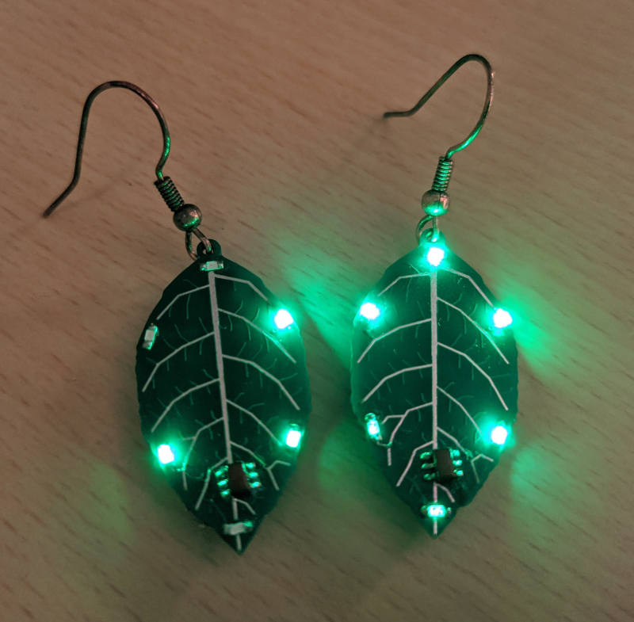

# Leaf-shaped earring with blinky lights

I made these a while ago. They each run on a CR1225 battery, which is one of the smallest 3V button cells that is still relatively easy to get.

PCB: [made one EasyEDA](https://oshwlab.com/aykevanlaethem/led-earring_copy_copy_copy_copy_copy)

Parts (per earring):

  * 1 [CR1225 battery holder](https://www.aliexpress.com/item/33014232938.html)
  * 1 ATtiny10 (if they are still hard to obtain via regular sources, try AliExpress)
  * 6 0603 LEDs of your choice (any should work, but blue or white might not work as well)
  * 3 resistors, 100Ω or so. I actually don't use resisters, and it works fine (the internal resistance of the battery and the attiny10 should be big enough) but the downside is that without resistors you can't reprogram them.
  * 1 earring hook (you can find these in craft stores for example)

Tools needed:

  * [USBasp](https://www.fischl.de/usbasp/) programmer for the ATtiny10, for example [this one](https://www.aliexpress.com/item/4001337860627.html). It has an older firmware on it, you need to flash the latest firmware on it with TPI support. I don't remember how I did this exactly, but [this tutorial](https://michaelteeuw.nl/post/a-tiny-success-flashing-the-usbasp/) seems fine.
  * Arduino Uno, to update the USBasp firmware (see previous point).
  * Test clips [like these](https://usd.saleae.com/products/test-clips-93). If you don't have them already, you can probably find them in other places for much cheaper.
  * Soldering iron, tin, etc.
  * Nail polish to paint the "bug" (attiny10) on the leaf.

The way I built these is as follows:

 1. Solder on all the parts on the front: the ATtiny10 and the 6 LEDs. The PCBs have a very small arrow in the silkscreen indicating the polarity. The LEDs themselves also have a very small arrow on the back. The direction of these should match.
 2. Solder the battery holder on the back.
 3. Optional, but recommended: solder some very short (1-2mm) wires on four of the pads on the back, namely: P0, P1, V- and R (meaning: pin 0, pin 1, ground, and reset). This is so you can connect the programmer using the test clips. V+ (VCC) is not necessary as you can simply clip to the battery holder instead.
 4. (to be continued)
