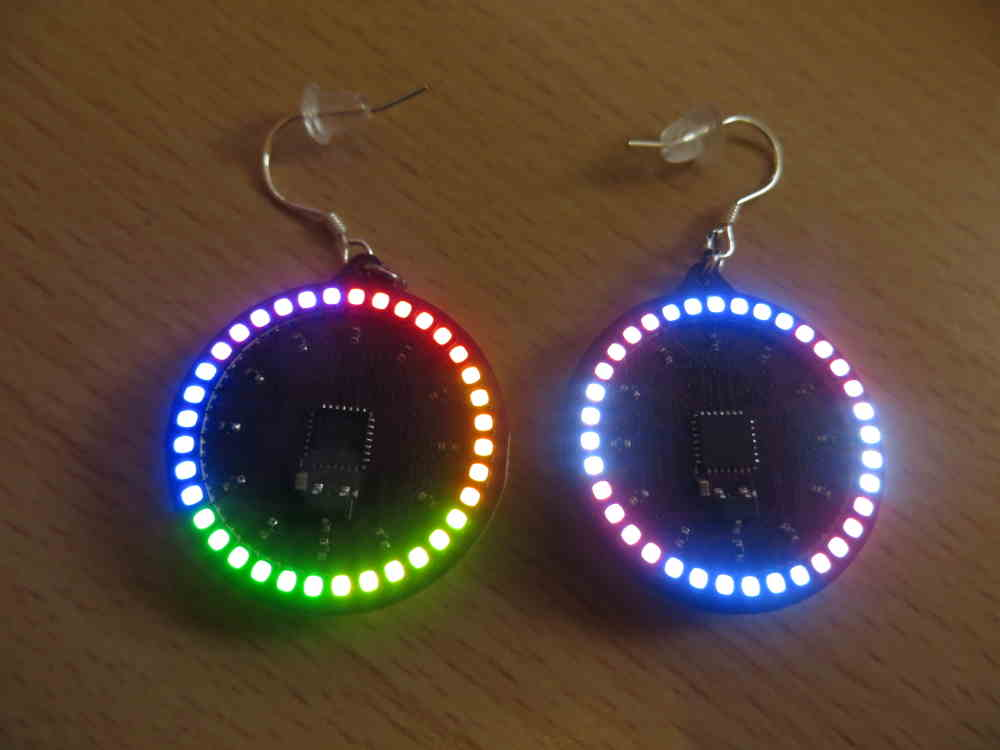

# 36-LED RGB earrings

These earrings are the next version of my [RGB earrings](../earring-ring). They contain 36 RGB LEDs that are controlled with a variant on Charlieplexing.



## Improvements

Changes compared to the previous 18 LED earrings:

  * They have better LEDs: these LEDs are 5-7x brighter at the same current consumption. This means they can run at lower power for the same brightness. The LEDs also include a little bit of diffusion which makes them look a lot nicer.
  * A 32-bit ARM chip means it can run more advanced animations at the same clock speed.
  * The LED bit depth is a bit lower: changed from 6 bits to 5 bits. But the colors should be more accurate due to added resistors which divide the current better.
  * 3 RGB LEDs get updated at the same time, instead of going through each color separately. Some people might find this less annoying (colors don't split up when moving your eyes and seeing the colors through persistence-of-vision).
  * The chip runs at a _lower_ clock speed to save power even with double the LEDs: 262kHz (it was 625kHz on the previous 18 LED earring). It can do so because of the reduced bit depth and because it updates more LEDs at the same time.
  * The chip uses a lot less power: it uses around 55µA while running while the 18 LED earring used around 410µA (reduction of ~87%, or around 7-8x lower power consumption). This is because of the lower clock frequency, but also because the STM32L0 series chips have a multispeed clock that doesn't need to run at a higher frequency than needed (the AVR chip on the 18 LED earrings run off of a divided 20MHz clock).
  * Reverse power protection was added, so now it won't harm the LEDs when the battery is inserted backwards. (With the previous LEDs, it didn't seem to harm them either but it was technically out of spec).

Overall the result is that the earrings look nicer, use less power, and are a little brighter.

## Programming

Before you start, you need to have [TinyGo installed](https://tinygo.org/getting-started/install/).

For programming, you will need an SWD programmer. Both [ST-Link](https://www.aliexpress.com/w/wholesale-st%2525252dlink-v2.html) and DAPLink programmers have been tested and work fine. You can connect the wires as indicated on the PCB itself. Specifically:

  * Connect VCC to 3.3V, or don't connect it if you have a battery inserted (make sure to _never_ connect VCC when a battery is inserted!).
  * Connect GND to the programmer GND.
  * Connect SWC to the SWCLK pin on the programmer.
  * Connect SWD to the SWDIO pin on the programmer.

You normally don't need to connect RST, but it is exposed since it's possible to put the chip in a state where it doesn't respond to programming anymore an you need to briefly connect RST to GND to reset it.

I found the easiest way to program these earrings is using a clip with pogo-pins, like [this one](https://nl.aliexpress.com/item/1005006712952020.html) (2.54mm distance, single row, 4 or 5 pins depending on needs). It makes quick iteration much easier.

Then, when the wires are connected correctly, you can program them like this (use `-programmer=cmsis-dap` if you are using a DAPLink programmer):

    tinygo flash -target=stm32l0x1 -opt=2 -programmer=stlink-v2

It should flash the binary to the earring, though it might need a few tries - for some reason the low clock frequency of the chip makes flashing a little bit less reliable.

## Writing your own patterns

You can write your own pattern and flash it to the earring! All you need is some extra (cheap) hardware and some software on your own computer - see above.

First we need to add a new mode constant:

```diff
 const (
 	modeRainbowTrace = iota
 	modeFireAndIce
 	modeNoise
 	modeFireRed
 	modeFireGreen
 	modeFireBlue
 	modeFlagLGBT
 	modeFlagTrans
+	modeCustom
 	modeLast
```

You can also reorder/remove modes here if you want, as long as you keep the `= iota` on the first and keep `modeLast` at the end.

Next we add the mode to the `animate` function:

```go
func animate(mode, led, frame int) Color {
	switch mode {
	...
	case modeCustom:
		return myCustomAnimation(led, frame)
	...
	}
}
```

And lastly we can write our own animation:

```go
func myCustomAnimation(led, frame int) Color {
	return NewColor(255, 0, 0)
}
```

How it works is that there are two parameters: the LED number (0..35) and the frame (running at about 30 frames per second, depending on the complexity of the animation). And the function just returns the RGB color for that particular LED, similar to a [pixel shader](https://en.wikipedia.org/wiki/Shader#Pixel_shaders). In this case we just return the static color red, but you can do more interesting things too! Here is an animation that rotates a single color around:

```go
func myCustomAnimation(led, frame int) Color {
	return NewColor(uint8((frame-led)%36)*4, 0, 0)
}
```

And here is a more advanced animation similar to the ["sparkle" mode of the HALO-90](https://github.com/openKolibri/halo-90/blob/master/readme.md#sparkle). It uses a [xorshift](https://en.wikipedia.org/wiki/Xorshift) function to achieve something that looks reasonably random:

```go
var xorshift32State uint32 = 1

// See https://en.wikipedia.org/wiki/Xorshift
func xorshift32() uint32 {
	xorshift32State ^= xorshift32State << 13
	xorshift32State ^= xorshift32State >> 17
	xorshift32State ^= xorshift32State << 5
	return xorshift32State
}

func myCustomAnimation(led, frame int) Color {
	if xorshift32()%16 == 0 {
		return NewColor(uint8(xorshift32()%64), 0, 0)
	}
	return NewColor(0, 0, 0)
}
```

You can also take a look at all the other animations in the file to get some ideas of what you can do. However, make sure to keep it simple! The earring is running at a low frequency and if the animation is too complex it will run slowly and the LEDs will be much dimmer.

## Credits

I got a lot of inspiration from the earrings made by [California STEAM](https://www.tindie.com/stores/californiasteam/). Unfortunately they're not shipping to Europe so I had to make my own 🙂

Another cool project I found was [this earring on Hackaday](https://hackaday.io/project/186402-ws2812b-neopixel-earring). It's built quite differently however, even using WS2812 LEDs!

And after I made my [previous earrings](../earring-ring), I found these [MNT x Kolibri HALO-90 electronic earrings](https://shop.mntre.com/products/mnt-x-kolibri-halo-90-electronic-earrings) which inspired me to get even higher pixel counts. 18 LEDs just doesn't cut it anymore in 2025! They've definitely been an inspiration, though of course their choices in electronics and animation patterns are quite different.
