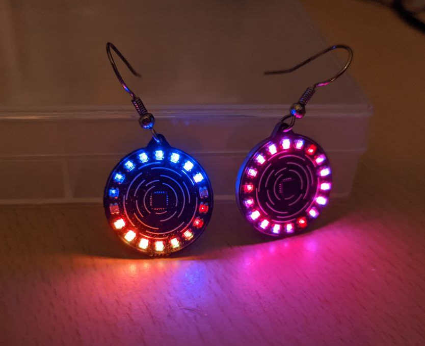
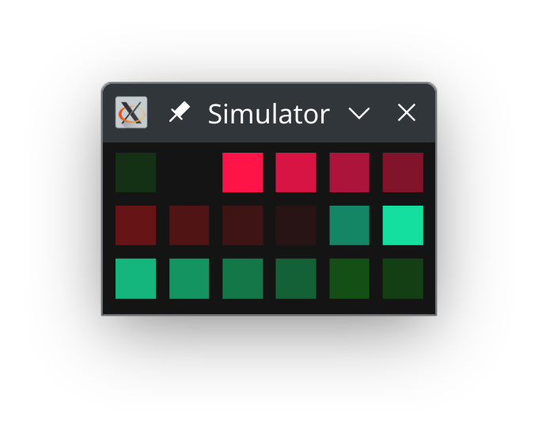

# Go powered LED earring

This is a simple project for LED earrings. The earrings have 18 individually addressable RGB LEDs.



The logic and the animations are all written in Go. The LEDs are controlled using bitbanging which is done in handcrafted inline assembly in C (through CGo).

In this directory you'll find:

  * The source files.
  * The schematic as a PDF file.
  * The gerber, BOM, and Pick-n-place files in case you want to fabricate this earring yourself.
  * An Altium project file, downloaded from EasyEDA (untested, might not work).

You can also find the design on [oshwlab.com](https://oshwlab.com/aykevanlaethem/led-earring-attiny1616_copy_copy_copy_copy) to easily produce them using JLCPCB. But also see [the project page on my website](https://aykevl.nl/projects/earrings), I might start selling them soon.

## Programming

The PCB exposes a few pins:

  - `+`, the plus side of the battery
  - `R`, the programming pin (originally "reset" but actually just the UPDI programming pin)
  - `-`, the battery minus side

**Be careful** with connecting the `+`! Probably, don't do it at all unless you put in some resistor. The LEDs are connected without any resistors and expect some internal resistance from the button cell battery.

You can make a programmer quite easily using a USB to UART converter and a 1kΩ resistor. You can find details on the [pymcuprog](https://pypi.org/project/pymcuprog/) project page (see "Serial port UPDI (pyupdi)").

To program, insert a CR1220/CR1225 coin cell battery and connect the `-` to the UART ground and `R` to the UPDI programming pin. Then run the following command:

    tinygo flash -target=attiny1616 -opt=2

That's all! It'll take a few seconds and the new code is running on the chip.


## Simulating

You can also simulate the code for easier debugging. Just run it as a Go program:

```
go run .
```



In the future, I hope to improve the simulator so that it will draw the LEDs in a circle like on the real earring.

## Revision history

I've made a few revisions of these earrings:

  * **v1** is the initial version I'm still using for myself and is the one I sold on GopherCon. I had to solder the button and battery holder on the back myself.
  * **v2** was a bit of a failure. It used a smaller LED but sadly most of those were not assembled correctly by JLCPCB (often, one of the LEDs didn't work). Therefore, I haven't published it.
  * **v3** is the one that actually works, and is easily mass-produced. The button and battery holder can be assembled by JLCPCB, meaning I only have to break them apart, program them, and attach earring hooks and such.

## Credits

I got a lot of inspiration from the earrings made by [California STEAM](https://www.tindie.com/stores/californiasteam/). Unfortunately they're not shipping to Europe so I had to make my own 🙂

Another cool project I found was [this earring on Hackaday](https://hackaday.io/project/186402-ws2812b-neopixel-earring). It's built quite differently however, even using WS2812 LEDs!

## License

Public domain. Feel free to use however you wish. Attribution is appreciated though.
