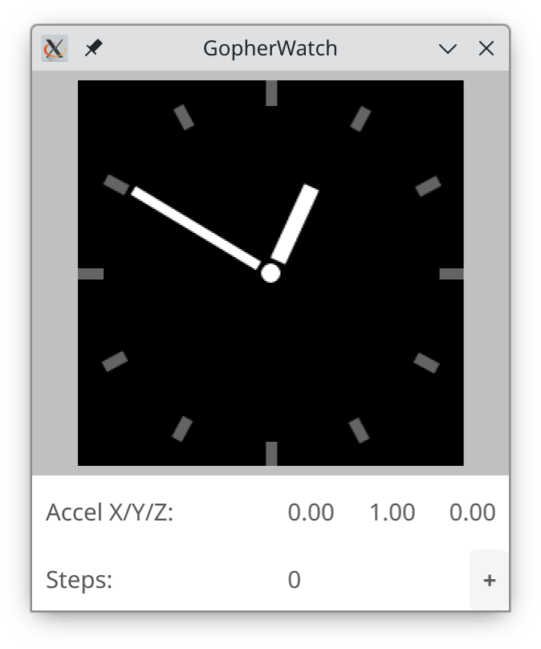

# GopherWatch - PineTime firmware written in Go

Work in progress. No guarantee that this firmware will ever be usable.

Features/goals:

  * Long standby time, possibly up to a few months.
  * Fast and responsive display.
  * Easy to work on, if you know the Go programming language.
  * Full-featured testing in simulation: use `go run .` to test the firmware directly on your computer instead of having to flash it to the PineTime.

**Warning**: installing this firmware comes at your own risk. While it looks reliable to me, there is always the risk that it bricks a sealed PineTime.

To use this bootloader:

 1. Install the [Wasp-OS bootloader](https://wiki.pine64.org/wiki/Switching_your_PineTime_between_InfiniTime_and_Wasp-os).  
    I have found the [OTA tool from InfiniTime](https://github.com/InfiniTimeOrg/InfiniTime/tree/main/bootloader/ota-dfu-python) to be more reliable in this step (it appears that the Wasp-OS ota.py doesn't work with InfiniTime).

        ./dfu.py -a <macaddress> --legacy -z path/to/reloader-mcuboot.zip

    Wait until you see a small blue pine icon that slowly turns white, and then the Wasp-OS bootloader screen.
    
 2. Create a firmware package. TODO: describe how this works ([hint](https://github.com/tinygo-org/tinygo/pull/3712)).
 3. Flash the firmware package using ota.py (from either InfiniTime or Wasp-OS).
    
        ./dfu.py -a <macaddress> --legacy -z path/to/watch.zip
 4. Enjoy the new firmware!

Once you have done the first OTA using the Wasp-OS bootloader and you have access to the SWD pins, you can flash the firmware using SWD:

    tinygo flash -target=./pinetime-wasp-bootloader.json

If you want to go back, you can follow the steps [on the wiki (Wasp-os => InfiniTime)](https://wiki.pine64.org/wiki/Switching_your_PineTime_between_InfiniTime_and_Wasp-os).

## Development

Check out the repository and run the following command to start the simulator:

    go run .

You may need to install a few dependencies first:

  * [Go](https://go.dev/dl/) (at least version 1.20)
  * [SDL2 headers](https://github.com/veandco/go-sdl2#requirements)

This is what it might look like:

You can also flash the firmware directly to the PineTime, using the following command (use the `-programmer=` flag if you don't use a J-Link programmer):

    tinygo flash -target=./pinetime-wasp-bootloader.json -opt=2
